# chat_all

&emsp;ChatGPT 移动端应用。

## 特性

- 流式输出响应，体验极佳；
- 支持 Markdown 渲染、代码高亮、Latex 渲染；
- 100+中文提示词，玩转 GPT 角色扮演；
- 支持一键复制代码；
- 支持对话模型微调；
- 国际化，支持中英文；
- 主题切换

## 效果图

|    功能    |              白天模式               |              黑夜模式              |
| :--------: | :---------------------------------: | :--------------------------------: |
|    对话    |   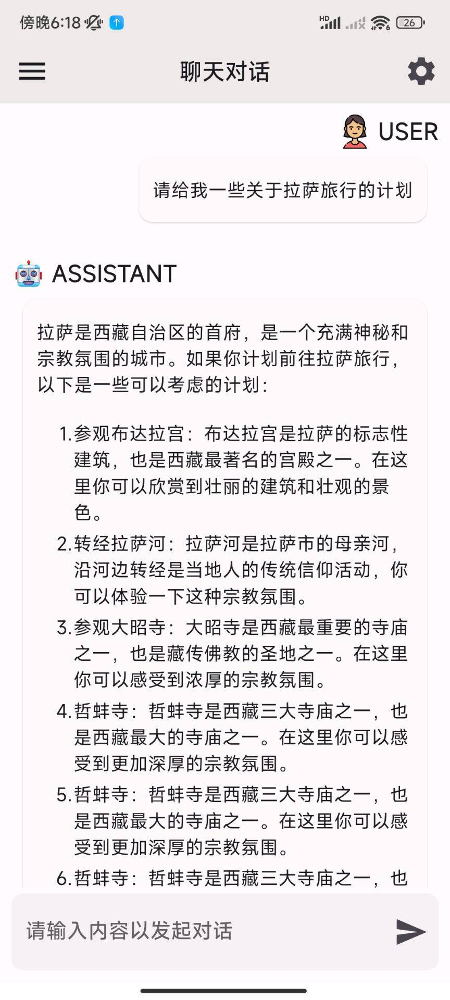    |   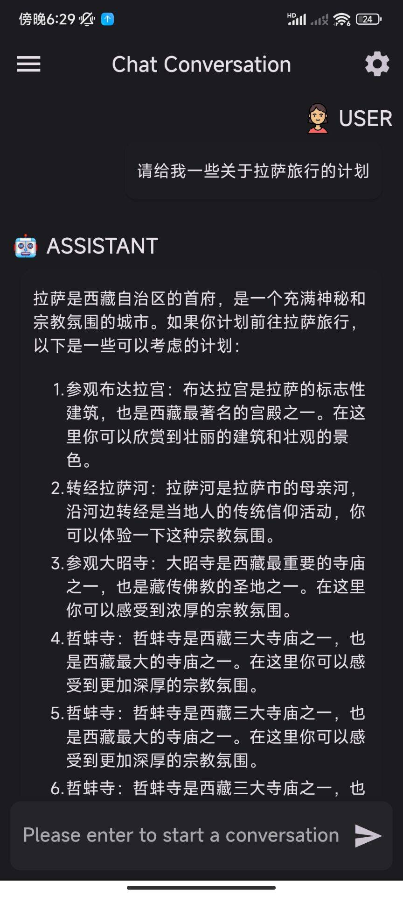    |
|  图片生成  | 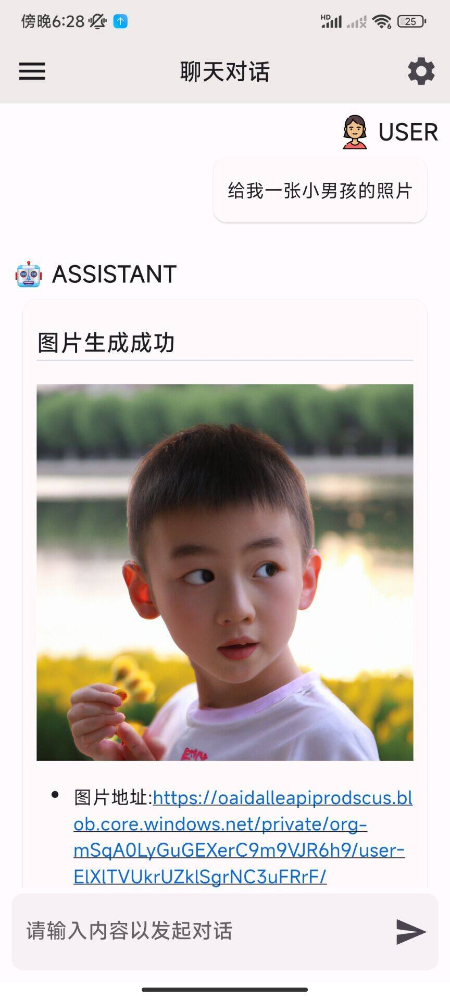 |  |
| 100+提示词 |   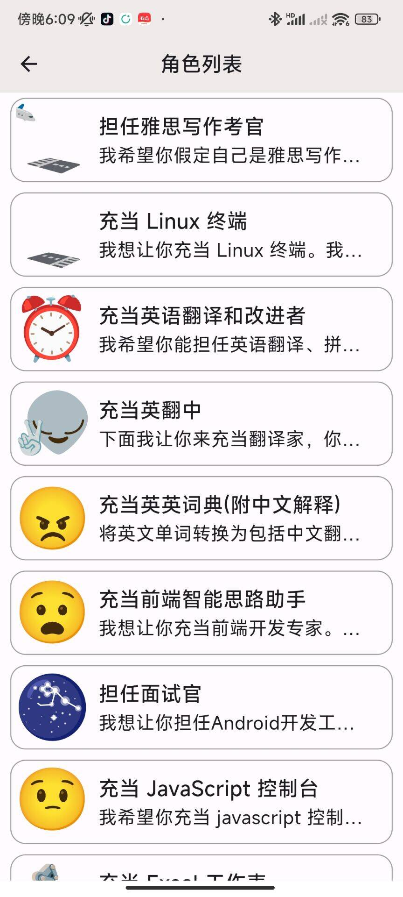   |   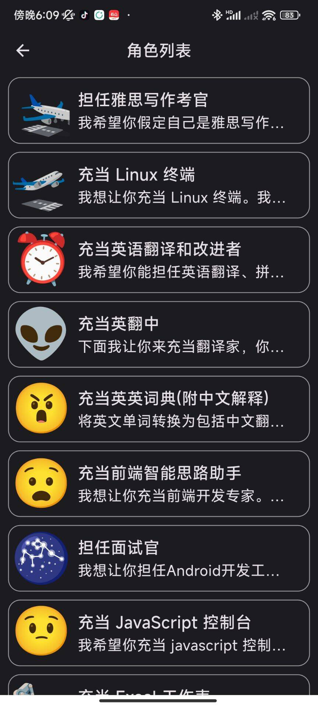   |
|  代码高亮  | 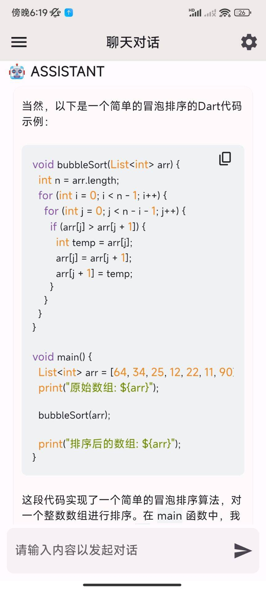 | 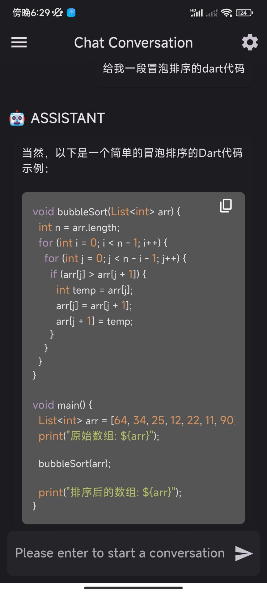 |
| Latex 渲染 |   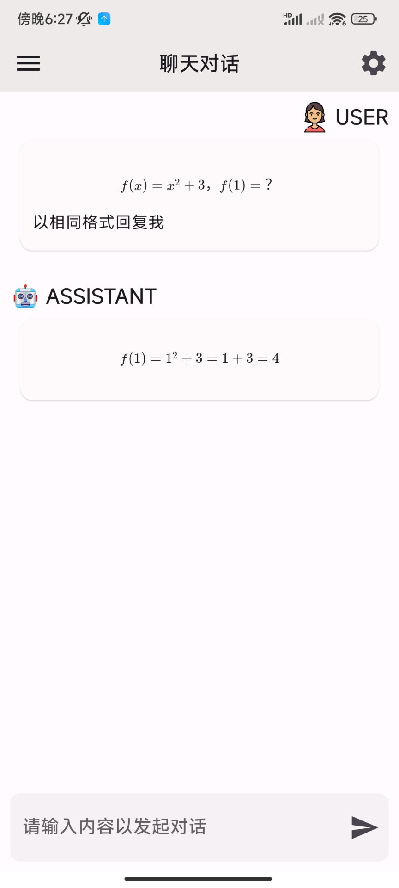   |   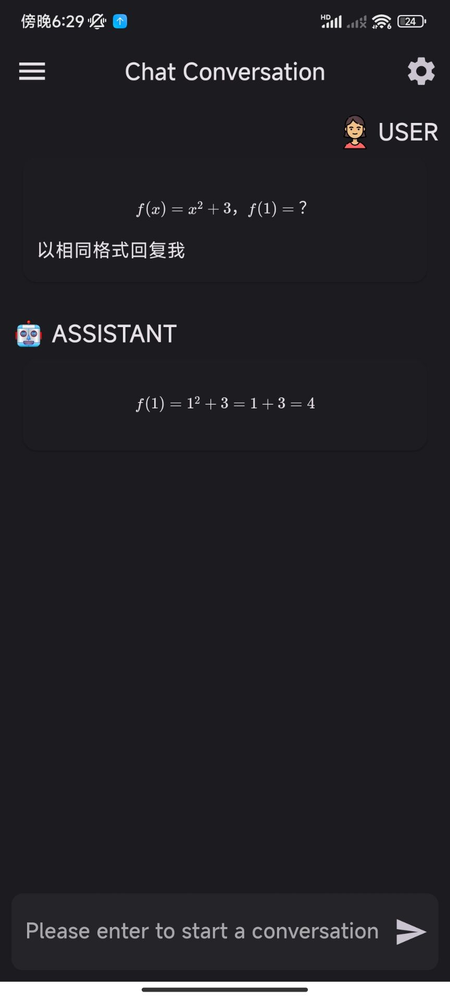   |
|  设置页面  |  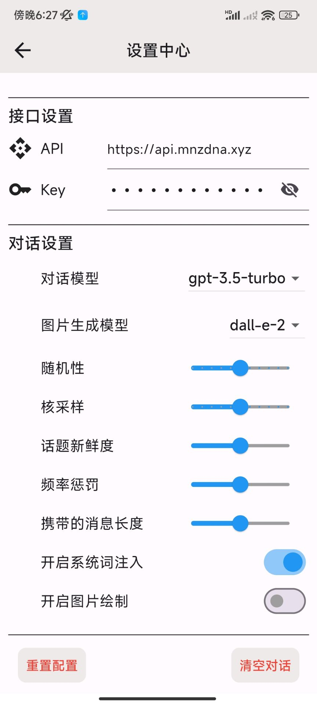  |  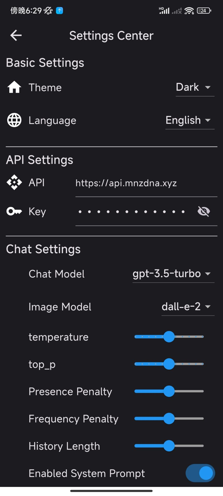  |
|   国际化   |    |    |
|    其它    |  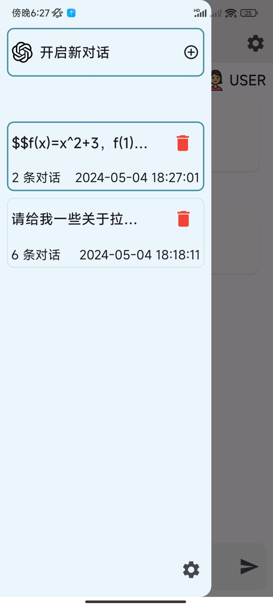  |  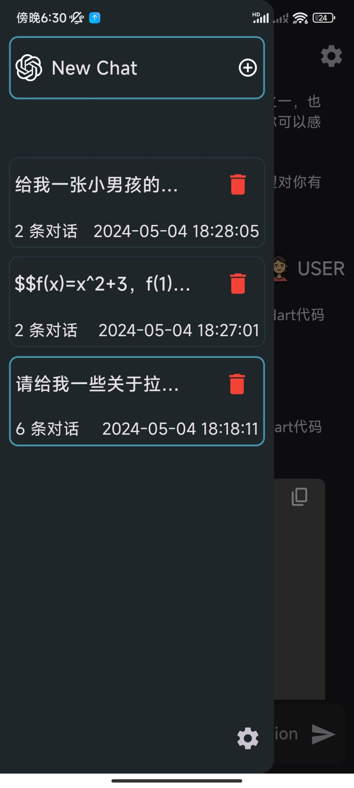  |
